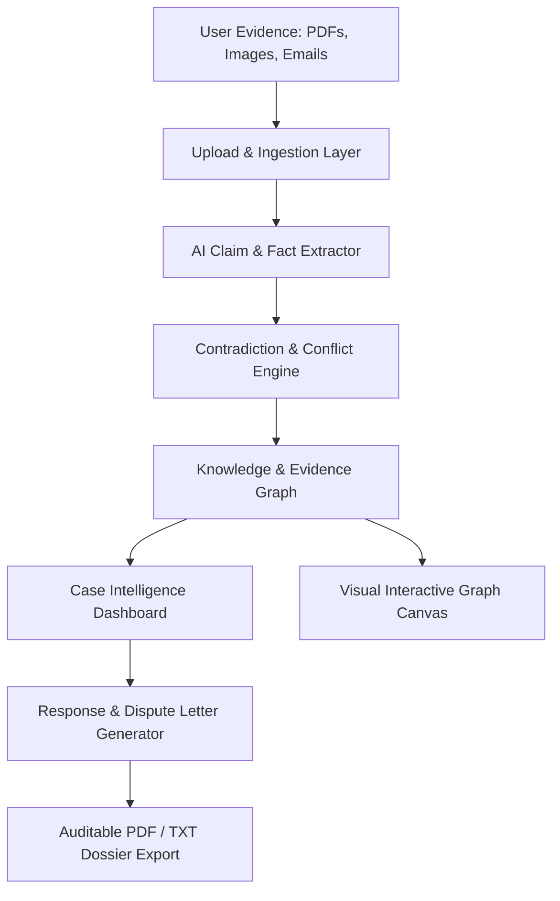

# ClaimPilot

> **Turn messy evidence into an auditable case.**  
> AI-powered evidence graph intelligence, contradiction discovery, and automated dispute resolution for warranties, insurance, rental deposits, and contractor disputes.

## Team

**Team Name:** Zero Latency

| Member | Role | Contribution |
| ------ | ---- | ------------ |
| **Jivites D** | Team Lead & Backend Architect | Backend pipeline design, AI/Gemma integration, Pinecone vector storage |
| **Sriram** | Frontend Developer | React UI, Evidence Graph visualisation, interactive case dashboard |
| **Prajit** | AI & Data Engineer | Claim/evidence/event extraction, contradiction detection, evidence scoring |
| **Sukanthan** | Full-Stack & DevOps | FastAPI REST endpoints, document ingestion pipeline, deployment & testing |

---

## Problem Statement

### The Problem
When consumers face wrongful claim rejections—such as warranty denials ("customer-induced physical damage"), withheld apartment security deposits, or auto repair disputes—they are forced to sift through complex PDFs, technical diagnostic sheets, receipts, and emails. Companies count on asymmetrical information, hoping claimants will give up. Simple chat LLMs lack structural auditability, hallucinate details, and cannot visually expose contradictions between what a company claims and what authorized reports actually document.

### Why We Chose This Problem
Dispute resolution requires verifiable, auditable facts rather than conversational text. By constructing an interconnected **Evidence Graph**, consumers and investigators can immediately isolate smoking-gun contradictions (e.g., company asserts "impact damage", but their own authorized repair technician recorded "no external impact marks observed") and generate ironclad dispute letters.

---

## Solution

ClaimPilot is an end-to-end evidence intelligence platform structured around 6 dedicated operational interfaces:

### 6 Core Interfaces

1. **🏠 Landing / Home:** Immediate value proposition, animated evidence graph visualization, and preset dispute categories (Warranty, Insurance, Rental, Contractor).
2. **📤 Create Case / Upload Evidence:** Multi-format document ingestion (PDF, DOCX, Images, Emails) with drag-and-drop file processing and fast-load demo cases.
3. **🔍 Case Investigation / Processing:** Real-time animated pipeline displaying live document parsing, claim extraction, evidence linking, contradiction searching, and timeline compilation.
4. **🧠 Case Intelligence Dashboard ⭐:** The primary intelligence workspace featuring:
   - Case Strength Score (e.g. 82/100)
   - Supporting vs. Company Evidence breakdown
   - Critical Contradiction detection metrics
   - Missing Evidence alerts
   - Tabbed deep dives: Overview, Evidence, Timeline, Contradictions, and Mini Evidence Graph.
5. **🕸️ Evidence Graph:** Dedicated visual canvas demonstrating directional links between claims, diagnostic reports, invoices, and photos categorized by **Supports**, **Contradicts**, and **Related To**, complete with an auditable node inspector.
6. **✉️ Response & Action Center:** Actionable dispute engine providing strategic recommendations, generated formal contest letters with tone selection (Formal, Firm, Concise), export tools (Copy, Download, Email), and a prioritized missing evidence checklist.

---

## Innovation and Differentiation

- **Structured Evidence Graphs over Chatbots:** Rather than a simple chat interface, ClaimPilot structures disparate claims and documents into a directional graph showing causal relations and direct contradictions.
- **Auditable Quotes & Source Verification:** Every node and contradiction points directly to the exact file source and section (e.g. *Repair_Report.pdf Section 3* vs. *Company_Response.pdf Page 1*).
- **Quantified Case Strength:** Algorithmic score assessing claim viability based on conflicting statements, tamper seal status, and documentation completeness.

---

## Technical Implementation

### Architecture



### Technology Stack

| Category | Technologies |
| -------- | ------------ |
| Frontend | React 18, Vite, JavaScript, responsive CSS |
| Backend | Python (FastAPI / Uvicorn), Pydantic schemas in `backend/` |
| AI Model | Google Gemma (`gemma-4-31b-it`) via Google AI Studio API |
| Vector DB | Pinecone (1024-dim cosine index) |
| Embeddings | `BAAI/bge-large-en-v1.5` (1024-dim sentence embeddings) |
| Data Contract | REST API under `/api/v1` |

### AI / Models

| Model | How it is used |
| ----- | -------------- |
| **Gemma (`gemma-4-31b-it`)** | **Primary extraction model — used standalone for all AI tasks.** Receives processed document text and returns structured JSON for: (1) factual **claim extraction**, (2) physical **evidence extraction**, and (3) real-world **event extraction** with timestamps. No other LLM or generative model is used. Rule-based fallback is only invoked when the Gemma API is explicitly unavailable. |

---

## Setup and Usage

### Prerequisites
- Any modern web browser (Chrome, Edge, Firefox, Safari)
- Python 3.10+ and Node.js 18+

### Running the Backend

From the repository root:

```bash
python -m pip install -r requirements.txt
python -m uvicorn backend.main:app --reload --port 8000
```

The API documentation is available at `http://localhost:8000/docs`. Set `GEMMA_API_KEY` in the environment or a local `.env` file to enable Gemma-backed extraction; rule-based extraction fallbacks are used when the model is unavailable.

### Running the Frontend

```bash
cd frontend
npm install
npm run dev
```

Vite serves the React application at `http://localhost:3000`. The default backend origin is `http://localhost:8000`; set `window.CLAIM_PILOT_API_URL` before the frontend module loads to use a different backend origin.

### API Contract

The React case workflow uses the endpoints below. Uploads must be actual supported files; entering a filename alone does not create analyzed evidence.

- `POST /api/v1/cases/` — Create a case
- `POST /api/v1/cases/{id}/documents` — Upload and extract documents
- `POST /api/v1/cases/{id}/analyze` — Extract claims, evidence and events; build graph and timeline
- `POST /api/v1/cases/{id}/score` — Return the evidence score, missing evidence and contradiction candidates
- `POST /api/v1/cases/{id}/response` — Generate an evidence-bounded response letter
- `POST /api/v1/analysis/score`, `/contradictions`, `/response` — Standalone typed analysis endpoints

Document text extraction currently supports PDF, DOCX, TXT, Markdown and JSON. Contradiction detection is a conservative lexical heuristic, not semantic or legal adjudication. Extracted quotes are marked unverified, so they are surfaced as candidates and excluded from evidence scoring and quote-backed letter drafting unless verified source data is supplied. Scores are informational and are not probabilities of success or legal advice.

---
#### Demo Video
https://youtu.be/31J9Tv6fMYU

#### Devpost link
https://dev.to/cbscu4aie24056/claimpilot-building-an-ai-evidence-intelligence-system-with-gemma-4-4flc

## Credits and License

### Credits

#### AI / Models
| Resource | Role |
| -------- | ---- |
| [Google Gemma `gemma-4-31b-it`](https://ai.google.dev/) via Google AI Studio | Primary AI extraction model

#### APIs & Services
| Resource | Role |
| -------- | ---- |
| [Pinecone](https://www.pinecone.io/) | Vector database for semantic search (1024-dim cosine index) |
| [Google AI Studio](https://aistudio.google.com/) | Gemma API endpoint |
| [Hugging Face Inference API](https://huggingface.co/inference-api) | Optional hosted embedding inference |

#### Backend Libraries
| Library | Role |
| ------- | ---- |
| [FastAPI](https://fastapi.tiangolo.com/) | REST API framework |
| [Uvicorn](https://www.uvicorn.org/) | ASGI server |
| [Pydantic](https://docs.pydantic.dev/) | Data validation and schema models |
| [google-genai](https://pypi.org/project/google-genai/) | Google GenAI SDK for Gemma API calls |
| [pinecone](https://github.com/pinecone-io/pinecone-python-client) | Pinecone Python SDK |
| [sentence-transformers](https://www.sbert.net/) | Local embedding model inference |
| [pypdf](https://pypdf.readthedocs.io/) | PDF text extraction |
| [python-docx](https://python-docx.readthedocs.io/) | DOCX text extraction |
| [python-dateutil](https://dateutil.readthedocs.io/) | Robust date/timestamp parsing |
| [rapidfuzz](https://github.com/maxbachmann/RapidFuzz) | Fuzzy string matching for contradiction detection |
| [python-dotenv](https://pypi.org/project/python-dotenv/) | `.env` configuration loading |
| [pytest](https://docs.pytest.org/) / [httpx](https://www.python-httpx.org/) | Backend testing |

#### Frontend Libraries
| Library | Role |
| ------- | ---- |
| [React 18](https://react.dev/) | UI component framework |
| [Vite](https://vitejs.dev/) | Frontend build tool and dev server |
| [Google Fonts — Inter](https://fonts.google.com/specimen/Inter) | Typography |

#### Built at
Built during **Hacktoberfest Hack Day — Coimbatore 2026**, organized by INIT CLUB × iDEA CLUB in collaboration with [Major League Hacking (MLH)](https://mlh.io/).

---

### License

This project is licensed under the **MIT License**.

```
MIT License

Copyright (c) 2026 Zero Latency Team

Permission is hereby granted, free of charge, to any person obtaining a copy
of this software and associated documentation files (the "Software"), to deal
in the Software without restriction, including without limitation the rights
to use, copy, modify, merge, publish, distribute, sublicense, and/or sell
copies of the Software, and to permit persons to whom the Software is
furnished to do so, subject to the following conditions:

The above copyright notice and this permission notice shall be included in all
copies or substantial portions of the Software.

THE SOFTWARE IS PROVIDED "AS IS", WITHOUT WARRANTY OF ANY KIND, EXPRESS OR
IMPLIED, INCLUDING BUT NOT LIMITED TO THE WARRANTIES OF MERCHANTABILITY,
FITNESS FOR A PARTICULAR PURPOSE AND NONINFRINGEMENT. IN NO EVENT SHALL THE
AUTHORS OR COPYRIGHT HOLDERS BE LIABLE FOR ANY CLAIM, DAMAGES OR OTHER
LIABILITY, WHETHER IN AN ACTION OF CONTRACT, TORT OR OTHERWISE, ARISING FROM,
OUT OF OR IN CONNECTION WITH THE SOFTWARE OR THE USE OR OTHER DEALINGS IN THE
SOFTWARE.
```
