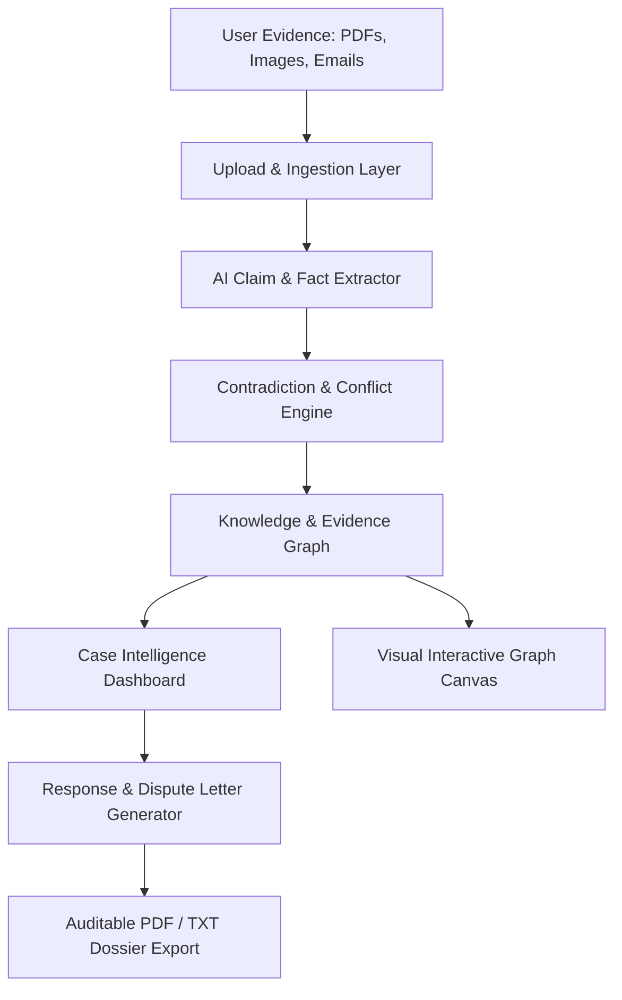

# ClaimPilot

> **Turn messy evidence into an auditable case.**  
> AI-powered evidence graph intelligence, contradiction discovery, and automated dispute resolution for warranties, insurance, rental deposits, and contractor disputes.

## Team

**Team Name:** ClaimPilot Team

| Member | Contribution |
| ------ | ------------ |
| Team Member 1 | Frontend Architecture, Interactive Evidence Graph, UI Design System |
| Team Member 2 | Backend API Development, Document Extraction Pipeline, AI Services |

---

## Problem Statement

### The Problem
When consumers face wrongful claim rejections—such as warranty denials ("customer-induced physical damage"), withheld apartment security deposits, or auto repair disputes—they are forced to sift through complex PDFs, technical diagnostic sheets, receipts, and emails. Companies count on asymmetrical information, hoping claimants will give up. Simple chat LLMs lack structural auditability, hallucinate details, and cannot visually expose contradictions between what a company claims and what authorized reports actually document.
this is what we wanted to address

### Why We Chose This Problem
Dispute resolution requires verifiable, auditable facts rather than conversational text. By constructing an interconnected **Evidence Graph**, consumers and investigators can immediately isolate smoking-gun contradictions (e.g., company asserts "impact damage", but their own authorized repair technician recorded "no external impact marks observed") and generate ironclad dispute letters.

---

## Solution

ClaimPilot is an end-to-end evidence intelligence platform structured around 6 dedicated operational interfaces:

### 6 Core Interfaces

1. **🏠 Landing / Home:** Immediate value proposition, animated evidence graph visualization, and preset dispute categories (Warranty, Insurance, Rental, Contractor).
2. **📤 Create Case / Upload Evidence:** Multi-format document ingestion (PDF, DOCX, Images, Emails) with drag-and-drop file processing and fast-load demo cases.
3. **🔍 Case Investigation / Processing:** Real-time animated pipeline displaying live document parsing, claim extraction, evidence linking, contradiction searching, and timeline compilation.
4. **🧠 Case Intelligence Dashboard ⭐:** The primary intelligence workspace featuring:
   - Case Strength Score (e.g. 82/100)
   - Supporting vs. Company Evidence breakdown
   - Critical Contradiction detection metrics
   - Missing Evidence alerts
   - Tabbed deep dives: Overview, Evidence, Timeline, Contradictions, and Mini Evidence Graph.
5. **🕸️ Evidence Graph:** Dedicated visual canvas demonstrating directional links between claims, diagnostic reports, invoices, and photos categorized by **Supports**, **Contradicts**, and **Related To**, complete with an auditable node inspector.
6. **✉️ Response & Action Center:** Actionable dispute engine providing strategic recommendations, generated formal contest letters with tone selection (Formal, Firm, Concise), export tools (Copy, Download, Email), and a prioritized missing evidence checklist.

---

## Innovation and Differentiation

- **Structured Evidence Graphs over Chatbots:** Rather than a simple chat interface, ClaimPilot structures disparate claims and documents into a directional graph showing causal relations and direct contradictions.
- **Auditable Quotes & Source Verification:** Every node and contradiction points directly to the exact file source and section (e.g. *Repair_Report.pdf Section 3* vs. *Company_Response.pdf Page 1*).
- **Quantified Case Strength:** Algorithmic score assessing claim viability based on conflicting statements, tamper seal status, and documentation completeness.

---

## Technical Implementation

### Architecture



### Technology Stack

| Category | Technologies |
| -------- | ------------ |
| Frontend | React 18, Vite, JavaScript, responsive CSS |
| Backend | Python (FastAPI / Uvicorn), Pydantic schemas in `backend/` |
| Analysis | Gemma-backed extraction with rule-based extraction fallback; deterministic evidence graph and scoring services |
| Data Contract | REST API under `/api/v1`; explicit sample cases remain available in the frontend |

---

## Setup and Usage

### Prerequisites
- Any modern web browser (Chrome, Edge, Firefox, Safari)
- Python 3.10+ and Node.js 18+

### Running the Backend

From the repository root:

```bash
python -m pip install -r requirements.txt
python -m uvicorn backend.main:app --reload --port 8000
```

The API documentation is available at `http://localhost:8000/docs`. Set `GEMMA_API_KEY` in the environment or a local `.env` file to enable Gemma-backed extraction; rule-based extraction fallbacks are used when the model is unavailable.

### Running the Frontend

```bash
cd frontend
npm install
npm run dev
```

Vite serves the React application at `http://localhost:3000`. The default backend origin is `http://localhost:8000`; set `window.CLAIM_PILOT_API_URL` before the frontend module loads to use a different backend origin.

### API Contract

The React case workflow uses the endpoints below. Uploads must be actual supported files; entering a filename alone does not create analyzed evidence.

- `POST /api/v1/cases/` — Create a case
- `POST /api/v1/cases/{id}/documents` — Upload and extract documents
- `POST /api/v1/cases/{id}/analyze` — Extract claims, evidence and events; build graph and timeline
- `POST /api/v1/cases/{id}/score` — Return the evidence score, missing evidence and contradiction candidates
- `POST /api/v1/cases/{id}/response` — Generate an evidence-bounded response letter
- `POST /api/v1/analysis/score`, `/contradictions`, `/response` — Standalone typed analysis endpoints

Document text extraction currently supports PDF, DOCX, TXT, Markdown and JSON. Contradiction detection is a conservative lexical heuristic, not semantic or legal adjudication. Extracted quotes are marked unverified, so they are surfaced as candidates and excluded from evidence scoring and quote-backed letter drafting unless verified source data is supplied. Scores are informational and are not probabilities of success or legal advice.

---

## Credits and License

- **Fonts:** Google Fonts (Inter)
- **Icons:** Custom SVG icon set
- **License:** MIT License