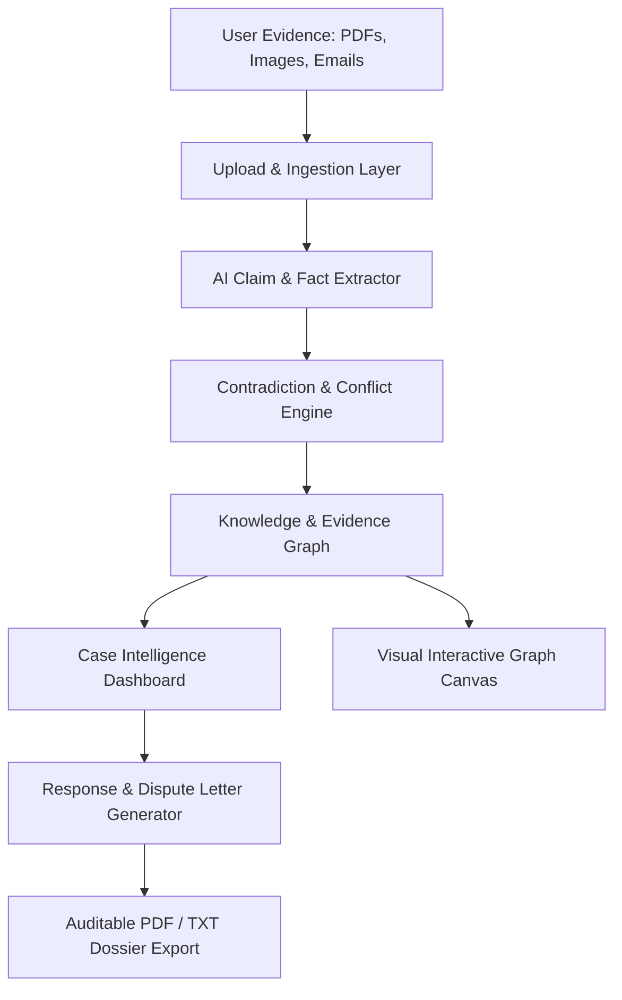

# ClaimPilot

> **Turn messy evidence into an auditable case.**  
> AI-powered evidence graph intelligence, contradiction discovery, and automated dispute resolution for warranties, insurance, rental deposits, and contractor disputes.

## Team

**Team Name:** ClaimPilot Team

| Member | Contribution |
| ------ | ------------ |
| Team Member 1 | Frontend Architecture, Interactive Evidence Graph, UI Design System |
| Team Member 2 | Backend API Development, Document Extraction Pipeline, AI Services |

---

## Problem Statement

### The Problem
When consumers face wrongful claim rejections—such as warranty denials ("customer-induced physical damage"), withheld apartment security deposits, or auto repair disputes—they are forced to sift through complex PDFs, technical diagnostic sheets, receipts, and emails. Companies count on asymmetrical information, hoping claimants will give up. Simple chat LLMs lack structural auditability, hallucinate details, and cannot visually expose contradictions between what a company claims and what authorized reports actually document.

### Why We Chose This Problem
Dispute resolution requires verifiable, auditable facts rather than conversational text. By constructing an interconnected **Evidence Graph**, consumers and investigators can immediately isolate smoking-gun contradictions (e.g., company asserts "impact damage", but their own authorized repair technician recorded "no external impact marks observed") and generate ironclad dispute letters.

---

## Solution

ClaimPilot is an end-to-end evidence intelligence platform structured around 6 dedicated operational interfaces:

### 6 Core Interfaces

1. **🏠 Landing / Home:** Immediate value proposition, animated evidence graph visualization, and preset dispute categories (Warranty, Insurance, Rental, Contractor).
2. **📤 Create Case / Upload Evidence:** Multi-format document ingestion (PDF, DOCX, Images, Emails) with drag-and-drop file processing and fast-load demo cases.
3. **🔍 Case Investigation / Processing:** Real-time animated pipeline displaying live document parsing, claim extraction, evidence linking, contradiction searching, and timeline compilation.
4. **🧠 Case Intelligence Dashboard ⭐:** The primary intelligence workspace featuring:
   - Case Strength Score (e.g. 82/100)
   - Supporting vs. Company Evidence breakdown
   - Critical Contradiction detection metrics
   - Missing Evidence alerts
   - Tabbed deep dives: Overview, Evidence, Timeline, Contradictions, and Mini Evidence Graph.
5. **🕸️ Evidence Graph:** Dedicated visual canvas demonstrating directional links between claims, diagnostic reports, invoices, and photos categorized by **Supports**, **Contradicts**, and **Related To**, complete with an auditable node inspector.
6. **✉️ Response & Action Center:** Actionable dispute engine providing strategic recommendations, generated formal contest letters with tone selection (Formal, Firm, Concise), export tools (Copy, Download, Email), and a prioritized missing evidence checklist.

---

## Innovation and Differentiation

- **Structured Evidence Graphs over Chatbots:** Rather than a simple chat interface, ClaimPilot structures disparate claims and documents into a directional graph showing causal relations and direct contradictions.
- **Auditable Quotes & Source Verification:** Every node and contradiction points directly to the exact file source and section (e.g. *Repair_Report.pdf Section 3* vs. *Company_Response.pdf Page 1*).
- **Quantified Case Strength:** Algorithmic score assessing claim viability based on conflicting statements, tamper seal status, and documentation completeness.

---

## Technical Implementation

### Architecture



### Technology Stack

| Category | Technologies |
| -------- | ------------ |
| Frontend | Vanilla Modern JavaScript (ES Modules), HTML5 Semantic Architecture, Custom Responsive Design System (CSS3 Tokens & Glassmorphism) |
| Framework Ready | Vite + React 18 component scaffolding in `frontend/src/` |
| Backend | Python (FastAPI / Uvicorn), Pydantic schemas in `backend/` |
| AI / ML Services | Multimodal OCR, Entity Extraction & Graph Linking |
| Data Contract | RESTful JSON API with automatic offline mock fallback |

---

## Setup and Usage

### Prerequisites
- Any modern web browser (Chrome, Edge, Firefox, Safari)
- Optional: Python 3.10+ (for backend) or Node.js 18+ (for Vite dev server)

### Running the Frontend

The frontend is completely self-contained and can be opened directly or served via any static HTTP server:

```bash
# Option 1: Direct browser launch
# Open frontend/index.html directly in any browser

# Option 2: Using python static server
cd frontend
python -m http.server 3000
# Visit http://localhost:3000 in your browser

# Option 3: Using npm / Vite (if Node.js is installed)
cd frontend
npm install
npm run dev
```

### Backend Integration Contract

The frontend includes an adapter in `frontend/js/api.js` that points to `http://localhost:8000/api`. When the backend is offline, the frontend automatically falls back to interactive demo data. Once the backend endpoints are live, they will seamlessly connect:

- `POST /api/cases` — Create a case
- `POST /api/cases/{id}/documents` — Ingest evidence files
- `GET /api/cases/{id}/analysis` — Return case intelligence & contradiction analysis
- `POST /api/cases/{id}/generate-response` — Generate formal dispute response

---

## Credits and License

- **Fonts:** Google Fonts (Inter)
- **Icons:** Custom SVG icon set
- **License:** MIT License